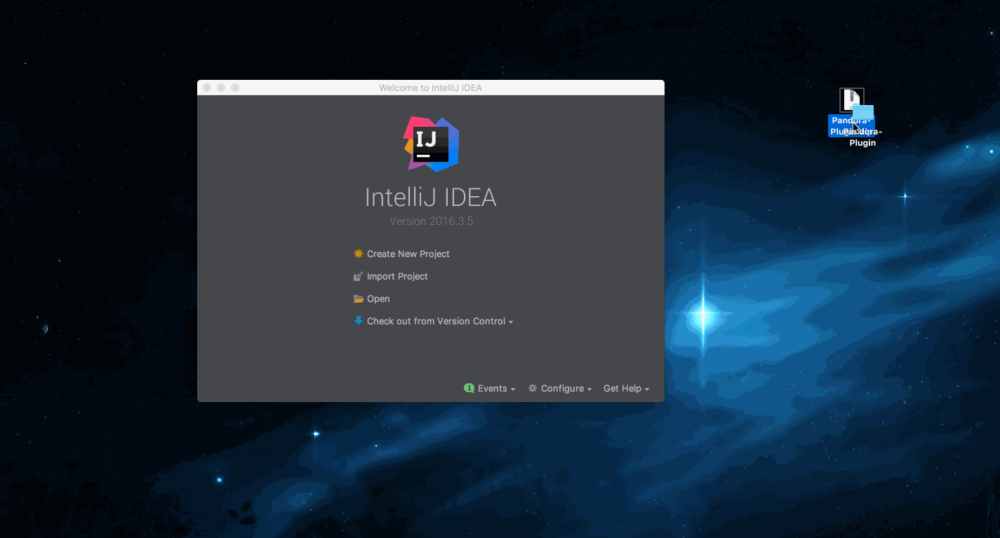

### 创建工作流

**操作流程：**

进入流式处理服务，开始搭建我们的第一个工作流，点击流式处理页面的**创建工作流**按钮，进入工作流编辑页面。

在工作流编辑器中，我们第一个看到的节点元素是`数据源`，其含义是**接收数据的消息队列**；在这个节点中，我们首先要给这个数据源起一个名字，这个名字也是**工作流名称**。

定义数据结构，`数据源`本身是支持结构化数据集的，我们可以自由定义这个数据集的字段与类型，在类型方面，支持`long`、`float`、`string`、`date`四种类型。

!> 注意：`float`类型的精度是64位。

?> 小技巧：
非结构化数据也可以支持，只要是以**行**为单位的数据，我们只需要在字段中定义1个字符串类型的字段，然后将一整条数据当做一个字段即可。

**数据源/消息队列节点填写参数说明：**

|参数|必填|说明|
|:---|:---|:---|
|名称|是|用来标识该消息队列的唯一性；</br>命名规则: 1-128个字符,支持小写字母、数字、下划线；</br>必须以大小写字母或下划线开头|
|所属区域|是|所属区域,计算与存储所使用的物理资源所在区域,目前支持华东区域；</br>此参数是为了降低用户传输数据的成本；应当尽量选择离自己数据源较近的区域|
|字段名称|是|定义数据结构，用来标识字段唯一性；</br>命名规则: 1-128个字符,支持小写字母、数字、下划线；</br>必须以大小写字母或下划线开头|
|字段类型|是|描述字段的数据类型,目前仅支持`long`、`date`、`float`和`string`,</br>其中`float`的最大精度是`float64`|
|是否必填|否|描述用户在传输数据时该字段是否必填|

定义完数据结构后，点击**创建**按钮，第一个工作流就创建成功了。

**操作演示：**


### 向工作流中推送数据

敬请期待...

### 使用logkit工具推送数据


简介
------

logkit是Pandora开发的一个通用的日志收集工具，可以将不同数据源的数据方便的发送到Pandora进行数据分析，除了基本的数据发送功能，logkit还有容错、并发、监控、删除等功能。

支持的数据源
------

1. 文件(包括csv格式的文件，kafka-rest日志文件，nginx日志文件等)
2. mysql数据表

工作方式
-----
logkit本身支持多种数据源，并且可以同时发送多个数据源的数据到Pandora，每个数据源对应一个逻辑上的runner，一个runner负责一个数据源的数据推送，工作原理如下图所示


使用方式
------

1. 下载&解压logkit工具
```
wget http://op26gaeek.bkt.clouddn.com/logkit.tar.gz && tar xvf logkit.tar.gz
```

2. 修改runner的配置
```
打开 _package/confs/default.conf
```
按照图示进行修改


3. 启动logkit工具
```
cd _package && ./logkit -f logkit.conf
```

logkit.conf是logkit工具本身的配置文件，主要用于指定logkit运行时需要的资源和各个runner配置文件的具体路径。

1. `max_procs` logkit运行过程中最多用到多少个核
2. `debug_level` 日志输出级别，0为debug，数字越高级别越高
3. `confs_path` 是一个列表，列表中的每一项都是一个runner的配置文件夹，如果每一项中文件夹下配置发生增加、减少或者变更，logkit会相应的增加、减少或者变更runner，配置文件夹中的每个配置文件都代表了一个runner。

典型的配置如下：
```
{
    "max_procs": 8,
    "debug_level": 1,
    "confs_path": ["confs"]
}
```
上面的配置指定了一个runner的配置文件夹，这个配置文件夹下面每个以.conf结尾的文件就代表了一个运行的runner，也就代表了一个logkit正在运行的推送数据的线程。


配置详解
------

典型的 csv Runner配置如下。

```
{
    "name":"csv_runner", # 用来标识runner的名字,用以在logkit中区分不同runner的日志
    "reader":{
        "mode":"dir", # 是读取方式，支持`dir`和`file`两种
        "log_path":"/home/user/app/log/dir/", # 需要收集的日志的文件（夹）路径
        "meta_path":"./metapath", # 是reader的读取offset的记录路径，必须是文件夹
    },
    "parser":{
        "name":"csv_parser", # parser的名字，用以在logkit中区分不同的parser
        "type":"csv",
        "csv_schema":"timestamp long, method string, path string, httpcode long" # 按照逗号分隔的字符串，每个部分格式按照`字段名 字段类型`构成，字段类型现在支持`string`, `long`, `jsonmap`, `float`
    },
    "senders":[{ # senders是
        "name":"pandora_sender",
        "sender_type":"pandora", # 如果数据要发送到Pandora，那么必须写pandora
        "pandora_ak":"your_ak", # 账号的ak
        "pandora_sk":"your_sk", # 账号的sk
        "pandora_host":"https://pipeline.qiniu.com",
        "pandora_repo_name":"your_repo_name", # 账号的repo name
        "pandora_region":"nb",
        "pandora_schema":"" # 留空表示将parse出来的字段全数发到pandora
}]
}
```

对于csv文件的上传，只需要修改上述配置文件的`log_path`,`csv_schema`,`pandora_ak`,`pandora_sk`,`pandora_repo_name`就完成了一个基本的上传csv文件的logkit配置。

### 数据导出

**操作流程：**

任何一个`数据源`和`消息队列`节点中的数据，都可以导出。

目前我们支持将数据导出到`对象存储`、`时序数据库`、`日志检索服务`、`HTTP服务器`，并且支持导出到RDS，如果您有这方面的需求，请通过工单或客服联系我们。

通过鼠标右键`数据源`或`消息队列`节点，选择`导出任务`，然后选择期望的导出方式，根据相应选项的提示，来将数据导出到对应服务中。

**导出任务节点填写参数说明：**

导出至HTTP：

|参数|必填|说明|
|:---|:---|:---|
|名称|是|用来标识这个导出任务的唯一性；</br>命名规则: 1-128个字符,支持小写字母、数字、下划线；</br>必须以大小写字母或下划线开头|
|服务器地址|是|服务器地址（ip或域名）,例如:`www.https://pipeline.qiniu.com` 或 `127.0.0.1:7758`|
|请求资源路径|是|请求资源路径（具体地址,不包含ip或域名）,例如:`/test/repos`|

!> 注意: 导出数据格式和`推送数据`相同。

导出至日志检索服务：

|参数|必填|说明|
|:---|:---|:---|
|名称|是|用来标识这个导出任务的唯一性；</br>命名规则:1-128个字符,支持小写字母、数字、下划线；</br>必须以大小写字母或下划线开头|
|数据仓库|是|选择或输入一个数据仓库，数据将会被导入到这个仓库当中|
|字段|是|源字段是从上游的消息队列节点选择一个字段，目的字段的意思是将源字段和时序数据库的序列中的某一个字段对应上|

> 消息队列中,字段的类型与日志检索服务中的字段类型需要作出如下对应:
> 
> 消息队列类型:string 对应 日志检索服务:string / date
> 
> 消息队列类型:long 对应 日志检索服务:long / date
> 
> 消息队列类型:float 对应 日志检索服务:float
> 
> 消息队列类型:date 对应 日志检索服务:date 

导出至时序数据库：

|参数|必填|说明|
|:---|:---|:---|
|名称|是|用来标识这个导出任务的唯一性；</br>命名规则: 1-128个字符,支持小写字母、数字、下划线；</br>必须以大小写字母或下划线开头|
|数据仓库|是|选择或输入一个数据仓库|
|序列|是|选择或输入一个序列，数据将会被导入到这个序列当中|
|时间戳|否|指定一个时间，会用rfc3339日期格式进行解析,如果格式不正确则会抛弃这一条数据,如果此项为空,则默认使用当前时间|
|字段|是|源字段是从上游的消息队列节点选择一个字段，目的字段的意思是将源字段和时序数据库的序列中的某一个字段对应上|

导出至对象存储服务：

|参数|必填|说明|
|:---|:---|:---|
|名称|是|用来标识这个导出任务的唯一性；</br>命名规则:1-128个字符,支持小写字母、数字、下划线；</br>必须以大小写字母或下划线开头|
|空间名称|是|对象存储中的Bucket名称|
|文件前缀|否|导出的文件名称的前缀|
|导出账号|是|Bucket所属用户的七牛账户名称|
|账号公钥|是|七牛账户的公钥|
|导出类型|是|可以将文件导成三种格式：json、text、parquet，</br>其中json和text可以选择是否将文件压缩，而parquet无需选择，默认自动压缩，压缩比大概为3-20倍|
|最大文件保存天数|是|文件存储时效，超过这个时间范围的文件会被自动删除，为0的话则永久存储|
|字段|是|源字段是从上游的消息队列节点选择一个字段，</br>目的字段的意思是将源字段和时序数据库的序列中的某一个字段对应上。|

**操作演示：（示例为导出至对象存储服务）**


### 数据计算（SQL）

**操作流程：**

`数据源`和`消息队列`节点中的数据，可以进行计算。

右键`数据源`和`消息队列`节点，选择计算任务。

计算的方式分为两种：`标准SQL计算`和`自定义代码计算`，它们两者可以并存，执行的顺序是先执行`自定义代码计算`，后执行`标准SQL计算`；在一个计算任务中，至少需要指定一种计算方式。

`SQL计算`就是自己编写SQL语句，对`数据源`或`消息队列`中的数据进行分批处理，并且以1分钟的粒度进行聚合，将结果自动发送到一个新的`消息队列`中。

`计算任务`是消耗物理资源的，所以每一个`计算任务`节点都需要为之分配**计算资源**（CPU & 内存）， 不同的`计算任务`之间的计算资源互相隔离，互不影响。

> SQL编写规范：
> 
> from之后的table名称为**stream**

**计算任务节点填写参数说明：**

|参数|必填|说明|
|:---|:---|:---|
|名称|是|用来标识这个计算任务的唯一性；</br>命名规则: 1-128个字符,支持小写字母、数字、下划线；</br>必须以大小写字母或下划线开头|
|容器类型、数量|是|计算资源的数量及类型|
|运行间隔|否|计算任务的运行时间间隔,如果不指定,系统默认使用`1分钟`|

**操作演示：**


### 自定义计算（Plugin）- Java

#### 下载&加载项目

**操作流程：**

首先，在[下载中心](/Downloads)中，下载Plugin-Java项目工程。

解压后，首先阅读**README.html**中的内容，然后使用Java IDE导入Pandora-Plugin项目。

等待项目依赖加载完成后，可以在src/main/java/demo/目录下查看一个简单的示例。

而src/main/java/userWrite/目录下是用户自行编写代码的地方。

**操作演示：**



#### 编写输入&输出类

**操作流程：**

首先，我们要定义我们编写代码的输入和输出。

输入通常是工作流中的消息队列，那么我们只需要将消息队列中的字段信息原封不动的复制一份即可，而输出是由我们自己编写的代码决定的，所以也需要提前定义好我们的输出信息。

负责数据源的类是src/main/java/userWrite/bean/SourceData.java

负责输出数据的类是src/main/java/userWrite/bean/OutputData.java

我们只需要根据src/main/java/demo/目录下的示例进行编写即可，代码中也有很详细的注释。

#### 编写业务逻辑代码

业务逻辑代码的编写在src/main/java/userWrite/customLogic/customlogic.java中的**parse**方法中。

最终的返回必须是List<OutputData>。

#### 打包上传

代码编写完成后，需要打成Jar包，然后上传至Pandora平台中。

!>注意：Jar包名称必须和src/main/java/userWrite/customLogic/目录下包含parse方法的类名称一致。

**操作演示：**


### 自定义计算（Plugin）- Scala

### 复杂的业务逻辑

工作流编辑器可以完成非常复杂的数据业务，它的整个架构是完全`拓扑逻辑`的。

依靠`消息队列`作为数据中间件，数据的计算可以往复循环，以达到满足复杂业务的需求。

**操作演示：**


### 便捷操作

`复制&粘贴`动作，快速完成重复工作。

`复制&粘贴`动作可以仅复制数据结构，也可以复制数据结构+内容。

**操作演示：**

