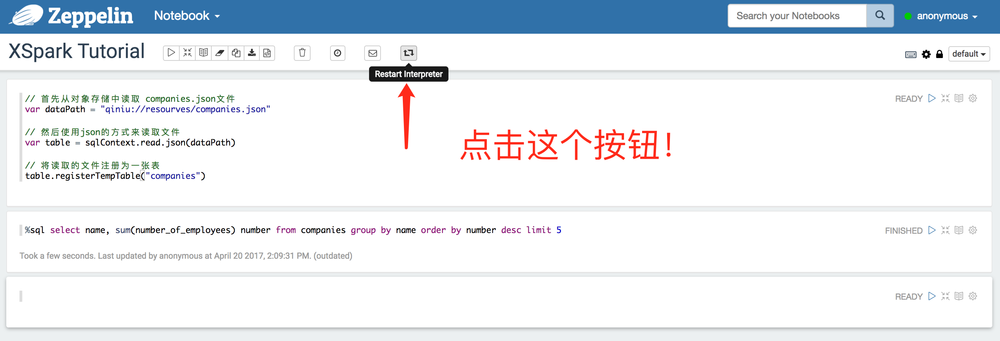
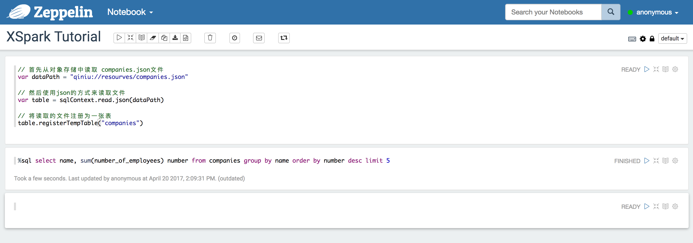
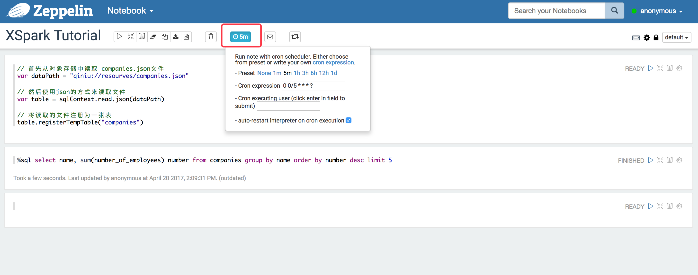
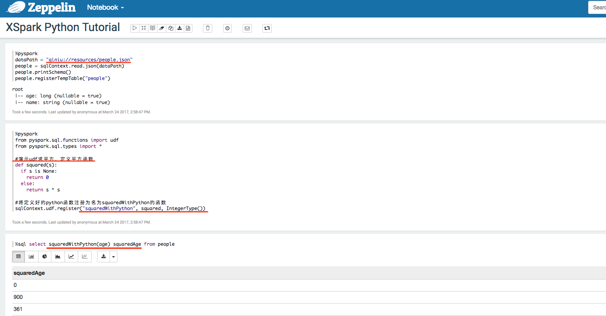
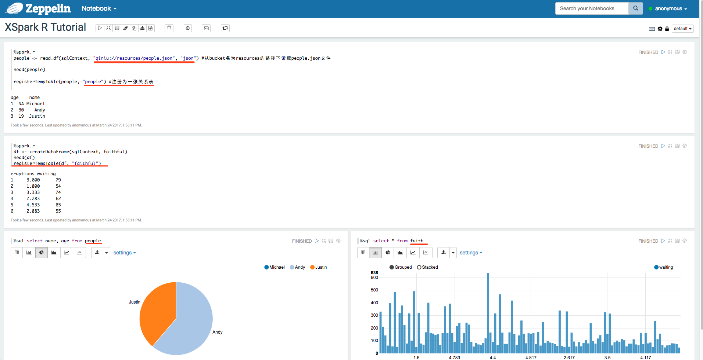
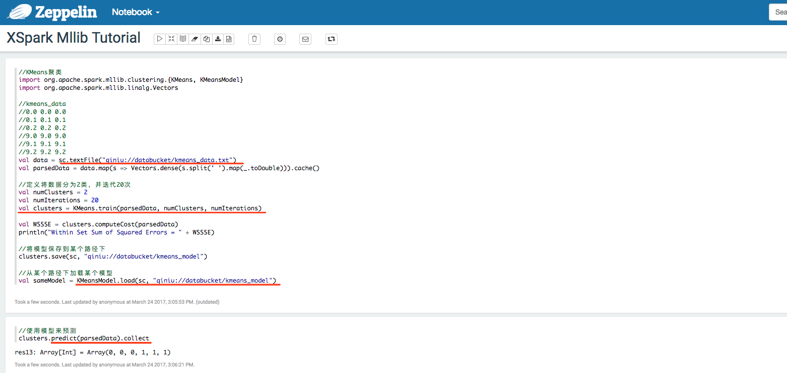
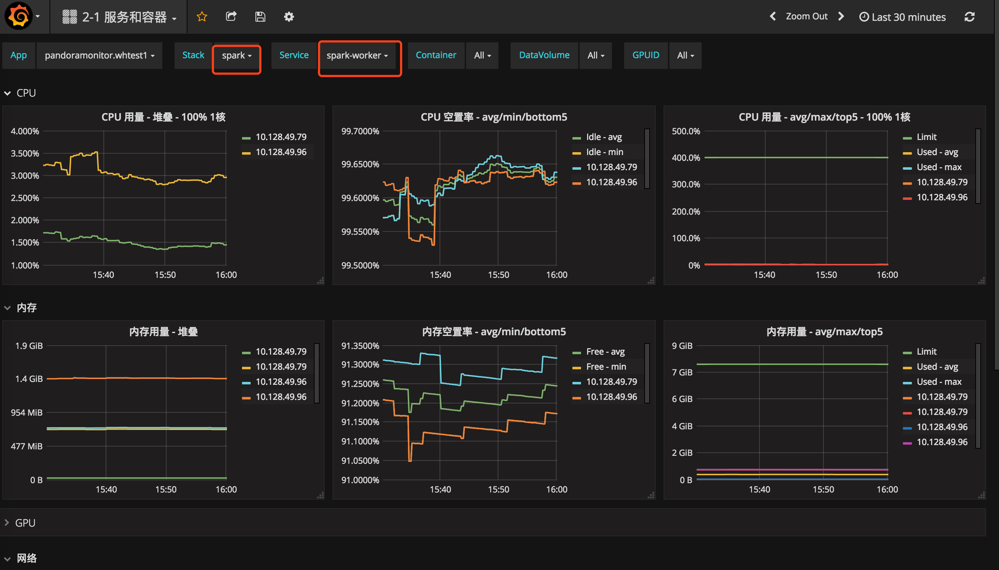

### 创建XSpark应用

**操作流程：**

在七牛控制台最下方的`应用市场`进入**XSpark**首页。

然后点击**新建部署**来创建我们第一个XSpark应用。

填写相应内容之后，点击**确定创建**，等待系统部署完成。

**填写参数说明：**

|参数|必填|说明|
|:--|:---|:--|
|应用名称|是|用来标识该应用的唯一性|
|应用别名|否|备注标识，支持中文，没有特殊含义|
|部署区域|是|计算与存储所使用的物理资源所在区域；</br>为了降低成本，请尽量选择离数据源较近的区域|

**操作演示：**


### 初始化配置

**操作流程：**

部署完成后，我们需要选择此应用的`Worker`规格以及数量，选择完成后点击**提交**按钮，等待应用初始化完成即可。

**填写参数说明：**

|参数|必填|说明|
|:--|:---|:--|
|Worker规格|是|不同大小的`CPU`与`内存`|
|Worker数量|是|选择的`Worker规格`使用数量|

!> Worker的概念： Spark集群的执行节点，用来执行**分布式计算任务**，一般来说，数量越多执行效率越高，规格与数量的大小与数量和执行效率成正比，请酌情选择。

> 除Worker外，还有一个Master（调度节点）的概念，调度节点是用来管理和分发**分布式计算任务**，一般来说，当获取较大数据源或计算结果较大时，调度节点配置越高，性能越好；它使用的资源包含在资源容器当中。

**操作演示：**


### 开始使用XSpark

#### Spark scala 示例

**操作流程：**

点击**开始使用**，在新弹出的页面上选择**XSpark Tutorial**进入代码编辑窗口。

在代码编辑窗口中，操作演示所使用的示例是读取**七牛对象存储的Bucket中的companies.json**文件，然后输出这个文件的所有字段信息。

意思就是，在代码编辑窗口中，我们需要指定一个文件路径，然后就可以对该文件中的数据进行计算，计算的代码由用户自行编写。

**操作演示：**


#### 加载第三方依赖

**操作流程：**

点击代码编辑窗口之间的缝隙，可以增加一个新的代码编辑窗口。

我们再顶部打开一个新的代码编辑窗口，然后输入

```
%spark.dep
```

换行后，即可添加第三方依赖，代码示例如下：

```
z.load("第三方依赖地址")
```

?>我们也支持添加第三方镜像仓库来加速依赖下载，示例如下：
```
z.addRepo("3rdRepo").url("http://maven.aliyun.com/nexus/content/groups/public/")
```

!>注意：如果遇到如下提示，需要停止XSpark已经在运行的任务，才能使用加载第三方依赖功能，停止的方法见下图：
```
Must be used before SparkInterpreter (%spark) initialized
Hint: put this paragraph before any Spark code and restart Zeppelin/Interpreter
```




**操作演示：**


#### Spark SQL 示例

**操作流程：**

我们可以在代码编辑窗口中编写Spark SQL来对数据进行分析。

首先我们需要将读取的文件注册成一张表，示例代码如下：

```
// 首先从对象存储中读取 companies.json文件
var dataPath = "qiniu://resourves/companies.json"

// 然后使用json的方式来读取文件
var table = sqlContext.read.json(dataPath)

// 将读取的文件注册为一张表
table.registerTempTable("companies")
```

将文件注册成表之后，我们即可编写 SQL 对数据进行分析：

```
%sql select name, sum(number_of_employees) number from companies group by name order by number desc limit 5
```

!> 注意： 编写SQL时， 头部必须包含`%sql`

**操作演示：**



#### 定时任务

**操作流程：**

XSpark使用`cron表达式`来配置定时任务的执行频率。

点击页面上的时钟图标，来配置定时

快捷选择项中，我们支持1分钟、5分钟、1小时、3小时、6小时、12小时、1天；

也可以手动输入`cron表达式`自定义定时周期。

建议勾选：`auto-restart interpreter on cron execution`使得每次运行都是独立的运行环境。

**操作演示：**




#### 基于XSpark的Python语言支持




#### 基于XSpark的R语言支持



#### 基于XSpark的机器学习




#### Spark UI
  对于有一定经验的Spark开发人员，可以访问`SparkUI`来看当前运行的任务状态。
  

  


#### XSpark容器监控

 XSpark提供了容器级别的CPU，内存，磁盘监控。可以给Spark任务的调优和故障排查提供有力的支持。


  

#### XSpark邮件告警功能

邮件告警经常配合定时任务来使用，当任务失败时，会有邮件发送具体的失败信息到指定的邮箱内。


#### XSpark快捷重启Interpreter功能

重启Interpretr会初始化Spark解释器。重启Interpreter会结束掉当前正在运行的spark任务，释放资源。


